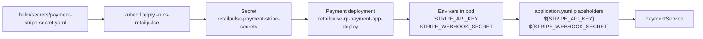

# Getting Started

## Stripe Secret Flow

The payment service already reads Stripe values from environment variables:

- `STRIPE_API_KEY`
- `STRIPE_WEBHOOK_SECRET`

In Helm/Kubernetes deployment, those values should come from a separately
applied Kubernetes Secret instead of being committed in chart values.



### Apply the Stripe Secret

Fill in the values in:

- `/Users/aungtuntun/SchoolProjects/SecuredRetailPulsePolyRepo/RetailPulsePolyRepo/helm/secrets/payment-stripe-secret.yaml`

Then apply it:

```bash
kubectl apply -n ns-retailpulse \
  -f /Users/aungtuntun/SchoolProjects/SecuredRetailPulsePolyRepo/RetailPulsePolyRepo/helm/secrets/payment-stripe-secret.yaml
```

Then deploy Helm for local development:

```bash
helm upgrade --install retailpulse \
  /Users/aungtuntun/SchoolProjects/SecuredRetailPulsePolyRepo/RetailPulsePolyRepo/helm \
  -n ns-retailpulse \
  -f /Users/aungtuntun/SchoolProjects/SecuredRetailPulsePolyRepo/RetailPulsePolyRepo/helm/values.yaml \
  -f /Users/aungtuntun/SchoolProjects/SecuredRetailPulsePolyRepo/RetailPulsePolyRepo/helm/values-local.yaml
```

For production:

```bash
kubectl apply -n ns-retailpulse-prod \
  -f /Users/aungtuntun/SchoolProjects/SecuredRetailPulsePolyRepo/RetailPulsePolyRepo/helm/secrets/payment-stripe-secret.yaml

helm upgrade --install retailpulse \
  /Users/aungtuntun/SchoolProjects/SecuredRetailPulsePolyRepo/RetailPulsePolyRepo/helm \
  -n ns-retailpulse-prod \
  -f /Users/aungtuntun/SchoolProjects/SecuredRetailPulsePolyRepo/RetailPulsePolyRepo/helm/values.yaml \
  -f /Users/aungtuntun/SchoolProjects/SecuredRetailPulsePolyRepo/RetailPulsePolyRepo/helm/values-prod.yaml
```

### Verify the Secret Wiring

```bash
kubectl get secret retailpulse-payment-stripe-secrets -n ns-retailpulse
kubectl describe deploy retailpulse-rp-payment-app-deploy -n ns-retailpulse
kubectl logs -n ns-retailpulse deploy/retailpulse-rp-payment-app-deploy --tail=100
```

For production, switch the namespace to `ns-retailpulse-prod`.

### Reference Documentation
For further reference, please consider the following sections:

* [Official Gradle documentation](https://docs.gradle.org)
* [Spring Boot Gradle Plugin Reference Guide](https://docs.spring.io/spring-boot/3.5.5/gradle-plugin)
* [Create an OCI image](https://docs.spring.io/spring-boot/3.5.5/gradle-plugin/packaging-oci-image.html)
* [Spring Web](https://docs.spring.io/spring-boot/3.5.5/reference/web/servlet.html)
* [Spring Security](https://docs.spring.io/spring-boot/3.5.5/reference/web/spring-security.html)
* [Spring Boot Actuator](https://docs.spring.io/spring-boot/3.5.5/reference/actuator/index.html)
* [Spring Boot DevTools](https://docs.spring.io/spring-boot/3.5.5/reference/using/devtools.html)
* [Docker Compose Support](https://docs.spring.io/spring-boot/3.5.5/reference/features/dev-services.html#features.dev-services.docker-compose)
* [OAuth2 Resource Server](https://docs.spring.io/spring-boot/3.5.5/reference/web/spring-security.html#web.security.oauth2.server)

### Guides
The following guides illustrate how to use some features concretely:

* [Building a RESTful Web Service](https://spring.io/guides/gs/rest-service/)
* [Serving Web Content with Spring MVC](https://spring.io/guides/gs/serving-web-content/)
* [Building REST services with Spring](https://spring.io/guides/tutorials/rest/)
* [Securing a Web Application](https://spring.io/guides/gs/securing-web/)
* [Spring Boot and OAuth2](https://spring.io/guides/tutorials/spring-boot-oauth2/)
* [Authenticating a User with LDAP](https://spring.io/guides/gs/authenticating-ldap/)
* [Building a RESTful Web Service with Spring Boot Actuator](https://spring.io/guides/gs/actuator-service/)
* [Accessing data with MySQL](https://spring.io/guides/gs/accessing-data-mysql/)

### Additional Links
These additional references should also help you:

* [Gradle Build Scans – insights for your project's build](https://scans.gradle.com#gradle)

### Docker Compose support
This project contains a Docker Compose file named `compose.yaml`.
In this file, the following services have been defined:

* mysql: [`mysql:latest`](https://hub.docker.com/_/mysql)

Please review the tags of the used images and set them to the same as you're running in production.
